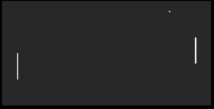
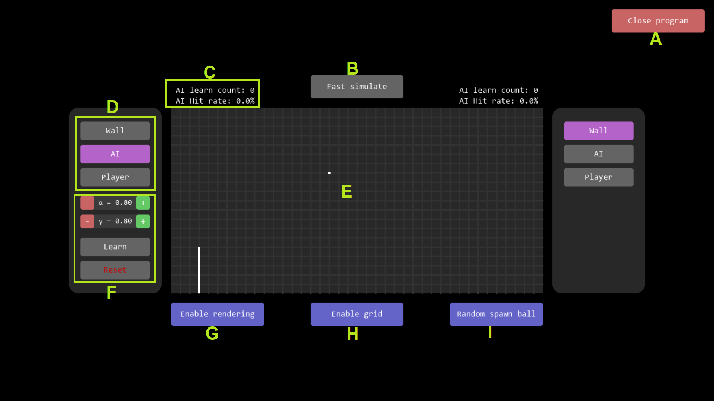
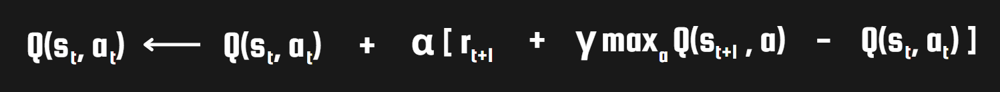
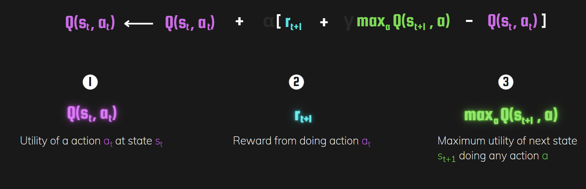
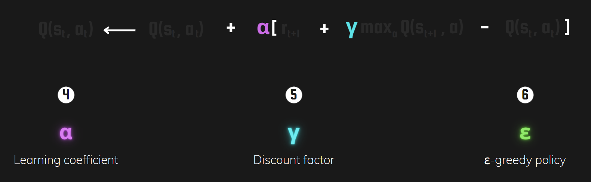

# reinforcement-pong-game
Teach computer to play Pong game using reinforcement learning  

This mini-project is the part of 'Artificial Intelligent' course in KMUTT university. The goal of this project is to implement reinforcement learning method, Q-learning, in order to teach the computer to play Pong game.

## The Pong Game
Pong game is a simple 2-player game that the players must control their own paddle in their side to hit the ball and prevent it from hitting the wall behind their paddle. The example of Pong game is shown below.  
<!-- # -->

  

In this project, each side can be selected as an AI agent, human player, or a simple wall. Please note that when the side is selected as a human player:

- the key `w` ans `s` is used to control the left paddle.
- the key `arrow up` and `arrow down` is used to control the right paddle.

## Program interfaces

  

- A: Close program button, click to close the program.
- B: Fast simulate button, click to increase the maximun FPS of the program (just to make the AI agent learn faster).
- C: Information of AI, learn count is the number of terminal state that AI has reached, hit rate is calculated from 1,000 newset terminal state.
- D: Side mode selection. Can select as Wall, AI (agent), and (human) Player.
- E: Game panel, show the actual game environment.
- F: AI setting. Can adjust parameter of the AI, enable-disable learning of AI, and reset the AI.
- G: Enable rendering button, stop rendering of all element exept itself. This can greatly increase the learning speed of an AI. Rendering will automatically be returned when the AI has 100% hit rate.
- H: Enable grid button, on and off visualization of the grid used for coordinating of the game elements.
- I: Random spawn ball button. Random position of the ball when enable, fix position to the center grid when disable.

## Learning method
The learning method is implementation of this Q-learing equation:

  

  

- 1: Utility function, was initiated with 0 in all state.
- 2: Rewards, +1 when hit the ball with paddle, -0.5 when the ball fall behind the paddle, -1 when the ball hit the wall behind the paddle. This also include cost of the actions, -0.001 when move paddle up or down, -0.0005 when stay still.
- 3: Maximum possible utility value of next state.

  

- 4: Learning coefficient (α), control how fast the agent can learn. The value falls between 0 and 1. The default value is 0.8 and adjustable in the program. The more the value is, the faster agent can learn.
- 5: Discount factor (γ), control how much utility value is decrease when propagate from vicinity state. The value falls between 0 and 1. The default value is 0.8 and adjustable in the program. When less than 1, the AI behavior introduces the optimal action that cost less but also reach the desired terminal (hit the ball with less movement).
- 6: Greedy policy, control how agent select the action to perform. The value falls between 0 and 1. The value is fixed to 1. When the value is setted to 1, the agent will alway choose the action with best outcome (maximum utility value) and has no random action.